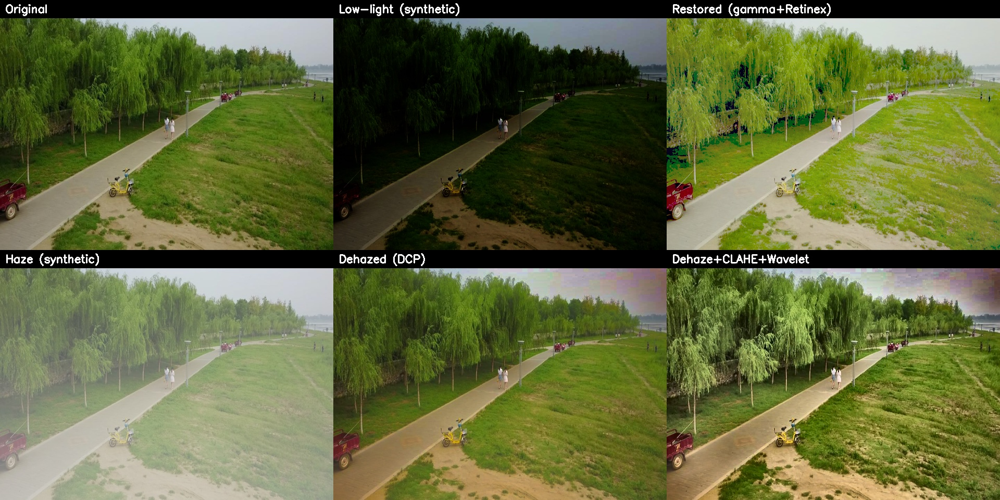
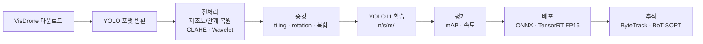
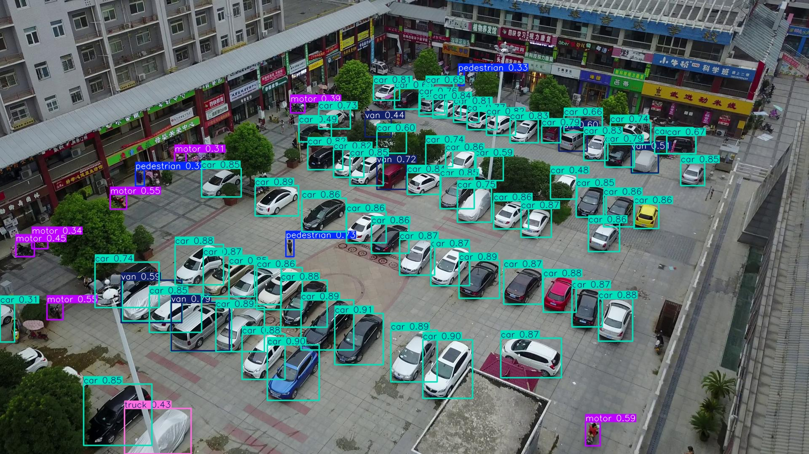
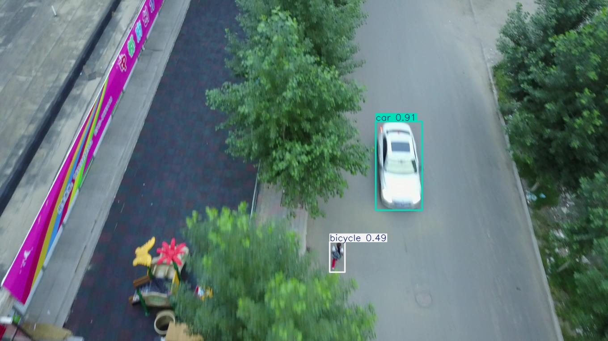
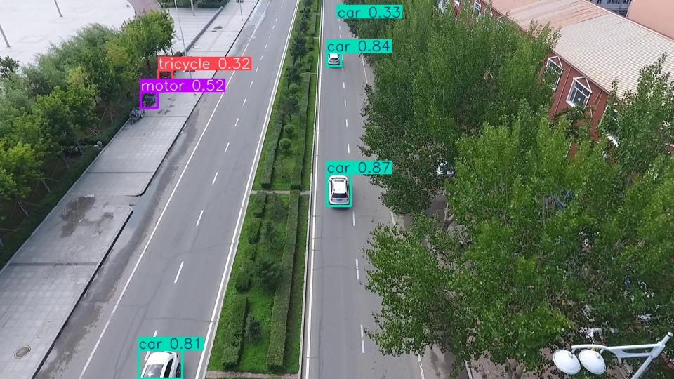
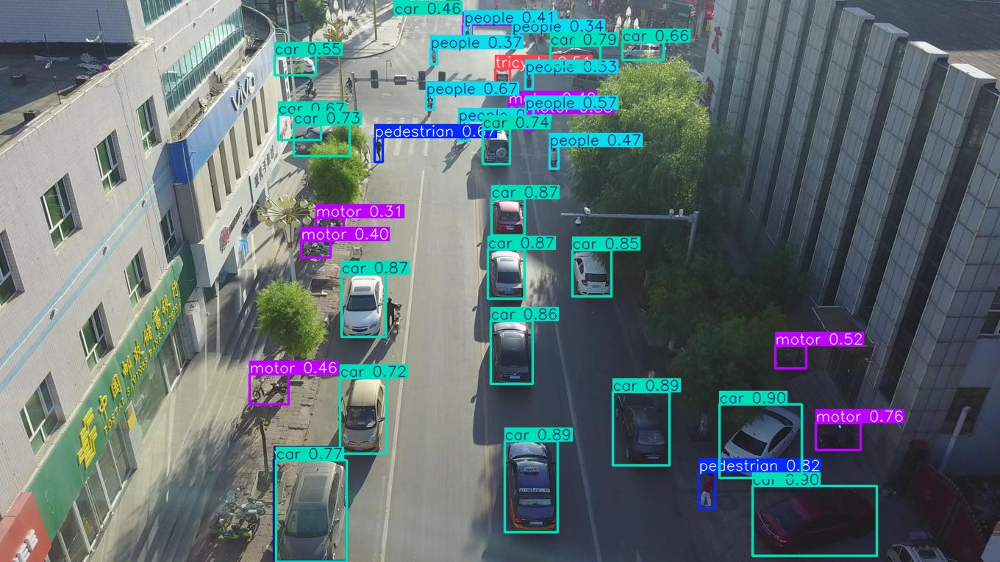

# Aerial Object Detection — VisDrone 기반 저조도·소형객체 탐지 End-to-End 파이프라인

> 드론 항공뷰 영상의 **소형·밀집 객체(10클래스)** 를 탐지하기 위한 컴퓨터비전 R&D 프로젝트입니다.
> **데이터 준비 → 영상 복원·전처리(저조도/안개) → 소형객체 특화 증강 → YOLO 학습 → mAP/속도 평가 → ONNX·TensorRT 배포 → 다중 객체 추적(MOT)** 까지
> 실서비스 배포를 가정한 전 과정을 직접 설계·구현했습니다.

<p align="center">
  
</p>
<p align="center"><i>저조도/안개 악조건 시뮬레이션에 대한 복원 파이프라인 결과 (Retinex · Dark Channel Prior · CLAHE · Wavelet)</i></p>

---

## TL;DR

- **데이터셋**: VisDrone2019-DET (train 6,471 / val 548 / test 1,610장, 10클래스)
- **전처리**: 저조도(적응형 감마+Retinex) / 안개(Dark Channel Prior) 자동 판별 복원 + CLAHE + Wavelet 디테일 강화
- **증강**: 소형객체 특화 3×3 타일링 / ±15° 회전 / 복합 증강 (bbox 좌표 재계산 직접 구현)
- **학습**: Ultralytics YOLO11 (n/s/m/l), H100 GPU, AutoBatch
- **배포**: ONNX / TensorRT(FP16) export + 정확도·속도 벤치마크
- **추적**: ByteTrack / BoT-SORT (TensorRT detector 연동)

> 모든 전처리·증강 알고리즘은 외부 코드 복사 없이 **공개 알고리즘을 기반으로 직접 구현**했습니다.

---

## 파이프라인



---

## 디렉토리 구조

```
visdrone_aerial_detection/
├── data/
│   ├── download_visdrone.py     # VisDrone DET 다운로드 (라이선스상 데이터 미포함)
│   └── visdrone_to_yolo.py      # VisDrone → YOLO 라벨 변환
├── preprocessing/
│   ├── clahe.py                 # LAB-CLAHE 대비 향상
│   ├── lowlight.py              # 적응형 감마 + Single-Scale Retinex
│   ├── dehaze.py                # Dark Channel Prior 안개 제거
│   ├── wavelet.py               # DWT 기반 디테일 강화
│   └── pipeline.py              # 3-Stage 적응형 복원 (자동 판별 + 폴더 일괄)
├── augmentation/
│   └── augment_yolo.py          # 타일링 / 회전 / 복합 증강 (bbox 재계산)
├── training/
│   ├── visdrone.yaml            # 데이터 설정 (10클래스)
│   └── train.py                 # YOLO11 학습 (멀티 GPU)
├── evaluation/
│   ├── eval_map.py              # mAP 평가 (클래스별 포함)
│   └── benchmark_speed.py       # 추론 속도 벤치마크 (PT/ONNX/TRT)
├── deployment/
│   └── export_model.py          # ONNX / TensorRT export + 검증
├── tracking/
│   └── run_tracking.py          # ByteTrack / BoT-SORT 영상 추적
└── assets/                      # README용 결과 이미지
```

---

## 재현 방법 (Reproduce)

```bash
# 0) 환경
pip install -r requirements.txt

# 1) 데이터 준비 (CC BY-NC-SA 3.0, 비상업적 용도)
python data/download_visdrone.py --out datasets/VisDrone
python data/visdrone_to_yolo.py --root datasets/VisDrone

# 2) (선택) 전처리 / 증강
python preprocessing/pipeline.py --src datasets/VisDrone/VisDrone2019-DET-train \
                                 --dst datasets/VisDrone_pp/VisDrone2019-DET-train
python augmentation/augment_yolo.py --src datasets/VisDrone/VisDrone2019-DET-train \
       --dst datasets/VisDrone_aug/case1 --case tiling --tiles 3

# 3) 학습
python training/train.py --model yolo11s --epochs 100 --device 0

# 4) 평가 / 속도
python evaluation/eval_map.py --weights runs/detect/yolo11s/weights/best.pt
python evaluation/benchmark_speed.py --weights runs/detect/yolo11s/weights/best.pt

# 5) 배포 (ONNX / TensorRT)
python deployment/export_model.py --weights runs/detect/yolo11s/weights/best.pt --format engine --half --eval

# 6) 추적
python tracking/run_tracking.py --weights runs/detect/yolo11s/weights/best.engine \
       --source aerial.mp4 --tracker bytetrack
```

---

## 주요 구현 포인트

### 1. 적응형 영상 복원 (`preprocessing/`)
- **자동 진단**: 영상의 밝기·대비·dark-channel 통계로 `lowlight / haze / normal` 자동 분류 후 적절한 복원 적용
- **저조도**: 영상 평균 밝기에 맞춘 적응형 감마 + Single-Scale Retinex
- **안개**: Dark Channel Prior(He et al.) 기반 transmission map 추정·복원
- **공통**: LAB-CLAHE 대비 향상 → Wavelet(DWT) 고주파 증폭으로 소형객체 윤곽 강화

### 2. 소형객체 특화 증강 (`augmentation/`)
- 항공뷰 특성상 객체가 작고 밀집 → **3×3 타일링**으로 상대 해상도를 높여 학습
- 타일 경계에서 잘리는 bbox는 면적 50% 기준으로 유효성 판정 후 좌표 재계산
- ±15° 회전 시 코너 변환 기반으로 bbox 재계산 (회전 robustness)

### 3. 배포 최적화 (`deployment/`, `evaluation/`)
- ONNX → TensorRT FP16 변환으로 추론 지연 단축, export 후 동일 데이터로 mAP 재검증
- PyTorch/ONNX/TensorRT 공통 속도 벤치마크(평균/중앙값 지연, FPS)

---

## 결과 (Results)

### 추론 예시 (YOLO11s, VisDrone val)

<p align="center">
  
  
</p>
<p align="center">
  
  
</p>
<p align="center"><i>밀집된 항공뷰 장면에서 차량·보행자·이륜차 등 소형객체 탐지 결과</i></p>

### 탐지 성능 (YOLO11s, 640, val 548장 / 38,759 instances)

| Metric | Score |
|--------|:-----:|
| **mAP@0.5** | **0.382** |
| **mAP@0.5:0.95** | **0.221** |
| Precision | 0.512 |
| Recall | 0.396 |

<details>
<summary>클래스별 mAP (펼치기)</summary>

| Class | mAP@0.5 | mAP@0.5:0.95 |
|-------|:------:|:------:|
| car | 0.780 | 0.534 |
| bus | 0.559 | 0.393 |
| motor | 0.442 | 0.186 |
| van | 0.431 | 0.300 |
| pedestrian | 0.414 | 0.179 |
| truck | 0.358 | 0.234 |
| people | 0.298 | 0.107 |
| tricycle | 0.271 | 0.146 |
| awning-tricycle | 0.136 | 0.083 |
| bicycle | 0.133 | 0.053 |

</details>

> VisDrone은 객체가 매우 작고(평균 수십 px) 밀집도가 높아 SOTA도 mAP@0.5가 40%대인 난도 높은 벤치마크입니다.
> 본 결과는 **YOLO11s + 640 해상도 baseline**으로, 전처리·증강·고해상도(1280)·대형 모델 적용 시 추가 향상이 기대됩니다.

### 추론 속도 (H100, 640×640, batch=1)

| Runtime | 지연(ms) | FPS | 비고 |
|---------|:------:|:---:|------|
| PyTorch (FP32) | 7.61 | 131 | end-to-end (전·후처리 포함) |
| **TensorRT (FP16)** | **3.05** | **327** | **2.5× 가속** |

> ONNX(GPU) 수치는 실행 환경의 ONNX Runtime GPU provider 설정에 따라 달라져 표에서 제외했습니다.

---

## 기술 스택

`Python` · `PyTorch` · `Ultralytics YOLO11` · `OpenCV` · `PyWavelets` · `Albumentations` ·
`ONNX Runtime` · `TensorRT` · `ByteTrack` · `BoT-SORT`

## 데이터셋 라이선스

본 저장소는 **코드만** 포함하며 데이터는 포함하지 않습니다. VisDrone은 **CC BY-NC-SA 3.0(비상업적)** 라이선스이며,
자세한 출처·인용·약관은 [`DATASET_NOTICE.md`](./DATASET_NOTICE.md)를 참고하세요. 코드는 MIT 라이선스([`LICENSE`](./LICENSE))입니다.
